# Gurukul — MERN Learning Platform

A full-stack learning platform built with MongoDB, Express, React, and Node.js. Teachers can create classrooms and manage materials, while students request access and view course contents once approved. Features secure authentication with JWT access tokens and rotating httpOnly refresh cookies.

## Tech Stack
* **Frontend**: React (Vite), Axios, Tailwind CSS / Custom CSS
* **Backend**: Node.js, Express.js, REST API
* **Database & Auth**: MongoDB (Mongoose), JWT, Bcrypt

---

## Essential Features
* **Role-Based Access (RBAC)**: Enforces `teacher` and `student` roles across protected API routes.
* **Approval Workflow**: Students request classroom access; teachers approve or reject requests.
* **Instant Revocation**: Database checks occur on material access requests so revoking access takes effect immediately.
* **Per-Device Sessions & Rotation**: Refresh tokens rotate on every request to detect token theft and allow single-device logouts.

---

## Quick Start
```bash
# Backend
cd backend && npm install && npm run dev

# Frontend
cd frontend && npm install && npm run dev
```
## Application Walkthrough & Workflow

### 1. Authentication
| Login Page | Registration Page |
| :---: | :---: |
| 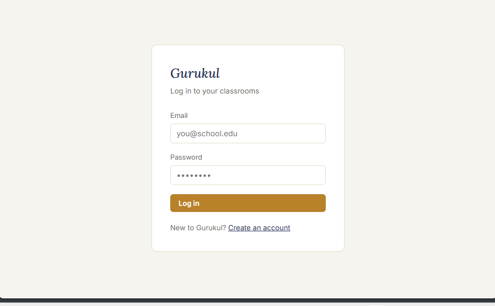 | 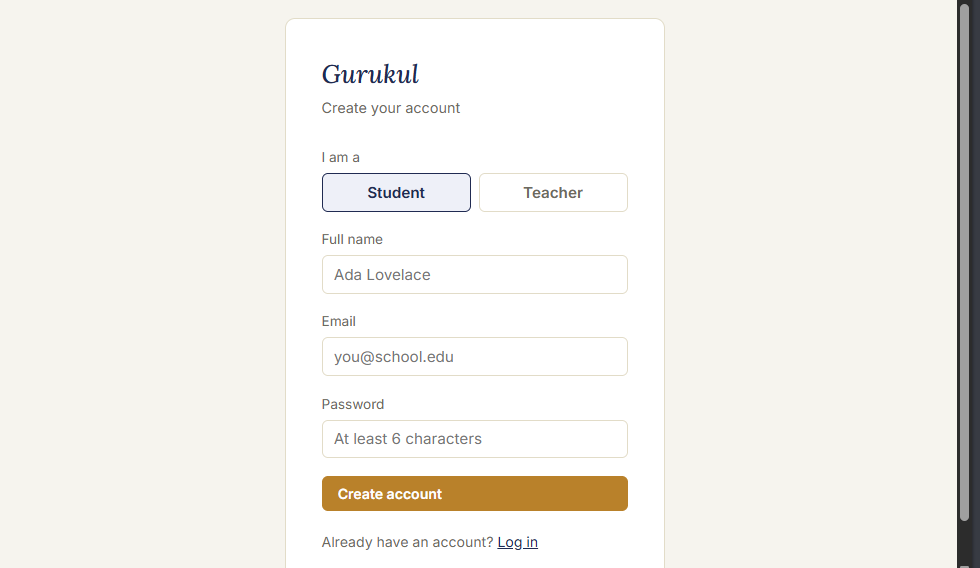 |

---

### 2. Dashboard Overview
| Student Dashboard | Teacher Dashboard View 1 | Teacher Dashboard View 2 |
| :---: | :---: | :---: |
| 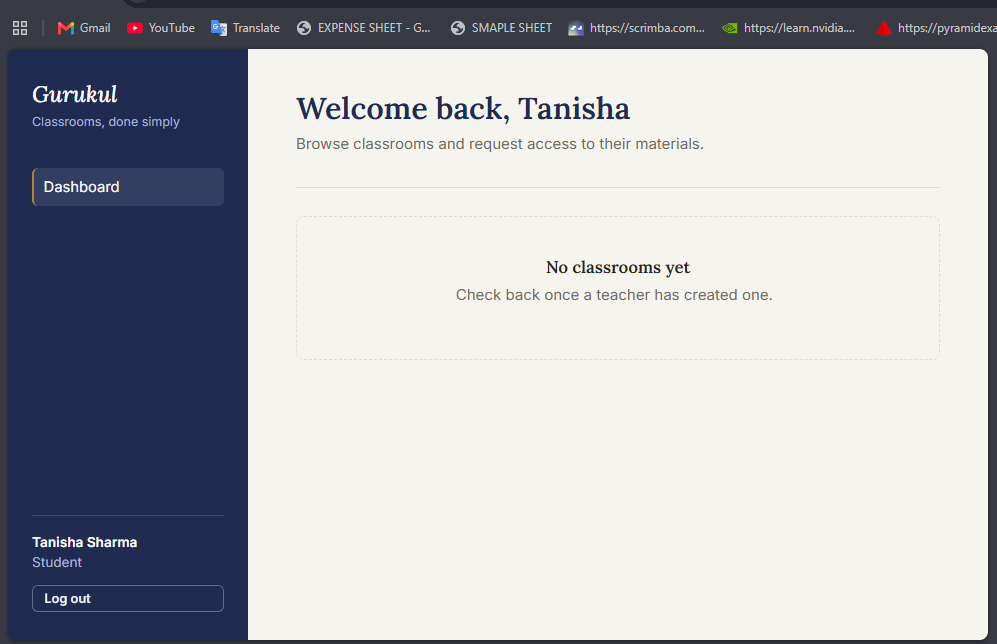 | 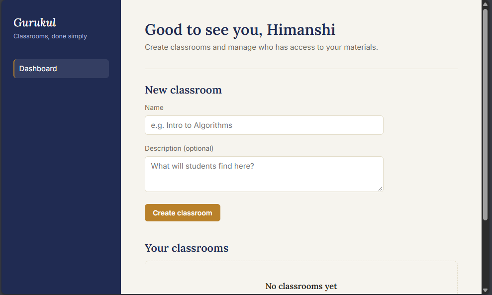 | 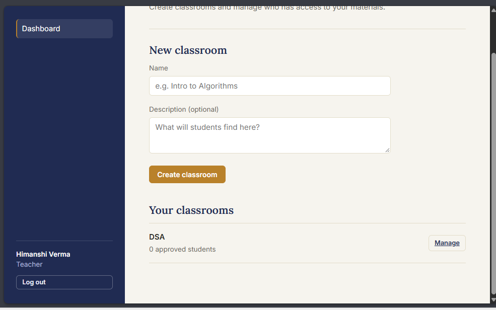 |

---

### 3. Student Join Request Flow
| Request to Join Classroom | Request Pending Status |
| :---: | :---: |
| 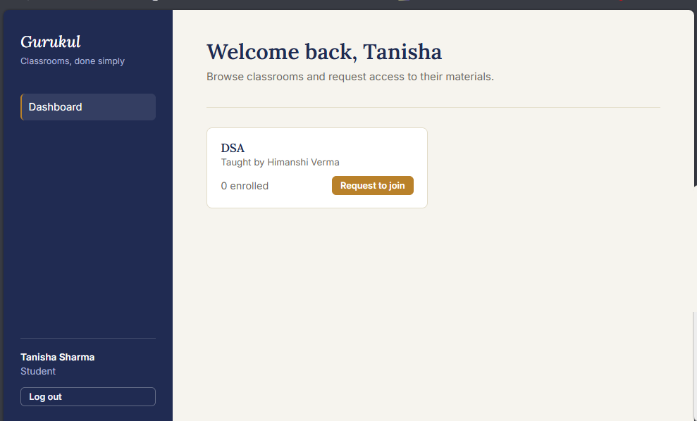 | 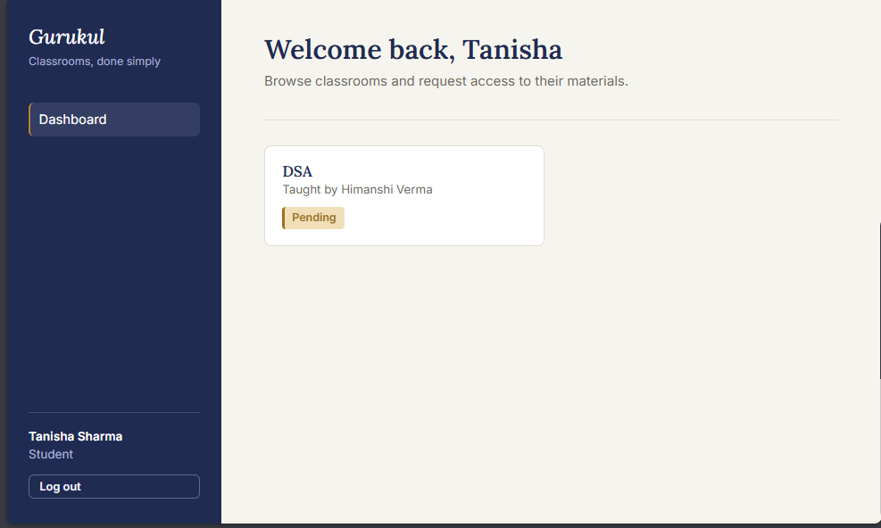 |

---

### 4. Teacher Approval Flow
| Pending Join Requests | Request Approval Screen |
| :---: | :---: |
| 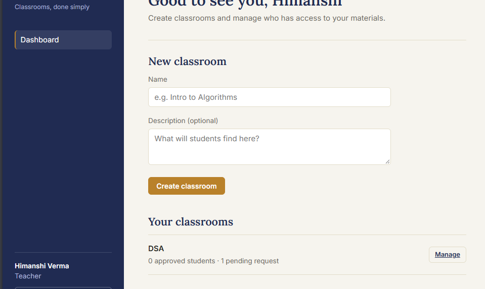 | 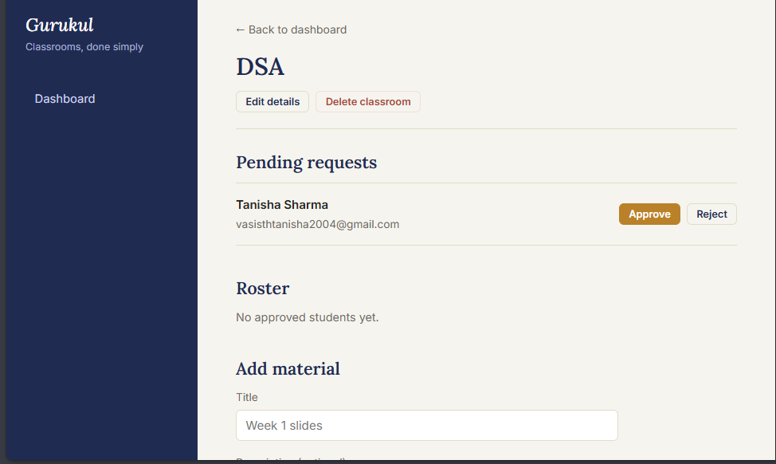 |

---

### 5. Access Granted Flow
| Approved Classroom View (Teacher) | Approved Status View (Student) |
| :---: | :---: |
| 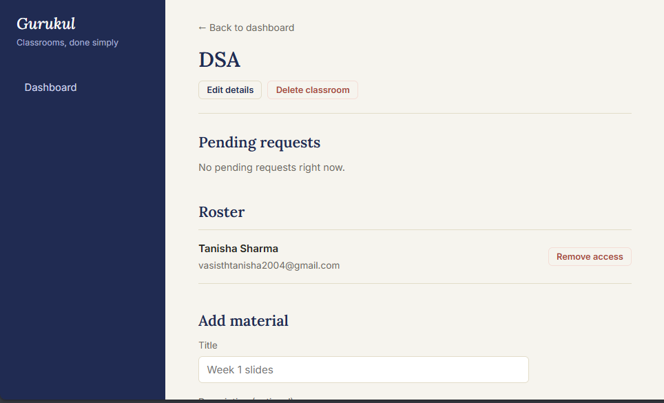 | 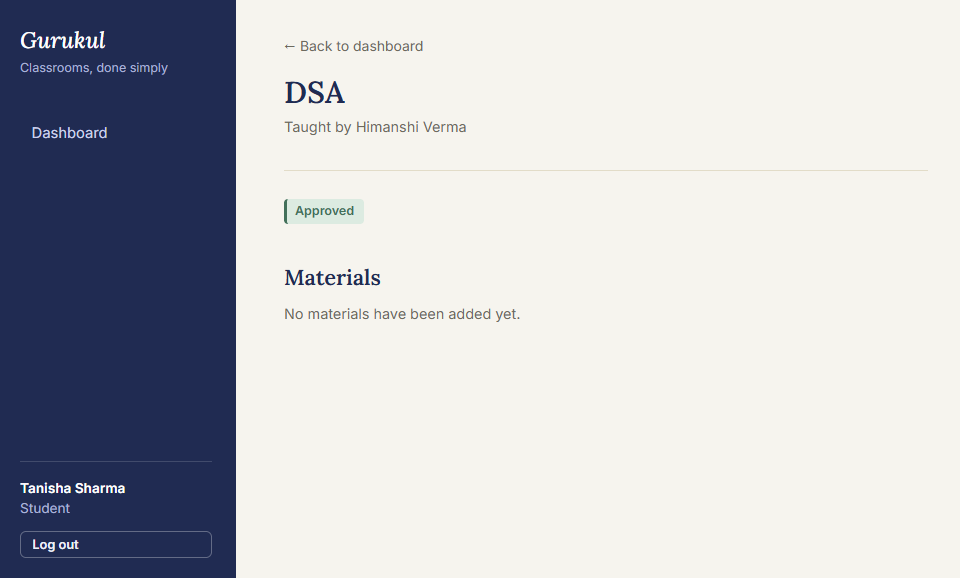 |
